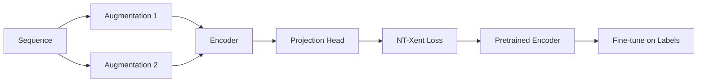

# Contrastive Learning

Contrastive learning enables self-supervised pretraining on unlabeled sequences, learning useful representations before fine-tuning.

## Overview



## Methods Supported

### SimCLR (Self-Supervised)

Learns representations by maximizing agreement between augmented views:

```python
from metapathpredict.models import ContrastiveModel, SimCLRLoss

model = ContrastiveModel(
    encoder=encoder,
    projection_dim=128,
)

criterion = SimCLRLoss(temperature=0.5)
```

### SupCon (Supervised Contrastive)

Uses labels to pull same-class samples together:

```python
from metapathpredict.models import SupConLoss

criterion = SupConLoss(temperature=0.07)
```

## Data Augmentation

### Available Augmentations

| Augmentation | Description | Parameter |
|--------------|-------------|-----------|
| Random Crop | Crop and pad back | `crop_ratio=0.9` |
| Random Mask | Mask positions | `mask_ratio=0.1` |
| Gaussian Noise | Add noise | `noise_std=0.1` |
| Reverse Complement | DNA RC | - |

### Usage

```python
from metapathpredict.data import SequenceAugmenter

augmenter = SequenceAugmenter(
    crop_ratio=0.9,
    mask_ratio=0.1,
    noise_std=0.1,
)

# Create two views
view1 = augmenter(sequence)
view2 = augmenter(sequence)
```

## Architecture

### Encoder

Uses ConfigurableCNN as backbone:

```python
from metapathpredict.models import ConfigurableCNN

encoder = ConfigurableCNN(
    kernel_preset="large",
    hidden_channels=[64, 128, 256],
    dropout=0.3,
)
```

### Projection Head

MLP that projects to contrastive space:

```python
from metapathpredict.models import ProjectionHead

projection = ProjectionHead(
    input_dim=256,    # Encoder output
    hidden_dim=256,
    output_dim=128,   # Contrastive space
)
```

### Complete Model

```python
from metapathpredict.models import ContrastiveModel

model = ContrastiveModel(
    encoder=encoder,
    projection_dim=128,
    hidden_dim=256,
)
```

## Training

### Configuration

```yaml
model:
  architecture: contrastive
  kernel_preset: large
  hidden_channels: [64, 128, 256]
  projection_dim: 256
  temperature: 0.07

training:
  epochs: 100
  batch_size: 256  # Large batch important!
  learning_rate: 0.0003
  scheduler: cosine
  warmup_epochs: 10

data:
  augmentation: true
  aug_crop_ratio: 0.85
  aug_mask_ratio: 0.15
```

### Pretraining Script

```python
import torch
from metapathpredict.models import ContrastiveModel
from metapathpredict.training import ContrastiveTrainer

# Create model
encoder = ConfigurableCNN(kernel_preset="large")
model = ContrastiveModel(encoder, projection_dim=128)

# Create trainer
trainer = ContrastiveTrainer(
    model=model,
    temperature=0.07,
    device="cuda",
)

# Pretrain (no labels needed!)
trainer.pretrain(
    train_loader,  # Unlabeled sequences
    epochs=100,
)

# Save pretrained encoder
torch.save(encoder.state_dict(), "pretrained_encoder.pt")
```

### Fine-tuning

```python
# Load pretrained encoder
encoder = ConfigurableCNN(kernel_preset="large")
encoder.load_state_dict(torch.load("pretrained_encoder.pt"))

# Add classifier
classifier = nn.Sequential(
    encoder,
    nn.Linear(256, 3),
)

# Fine-tune with labels
trainer = Trainer(classifier, config)
trainer.fit(train_loader, val_loader)
```

## NT-Xent Loss

Normalized Temperature-scaled Cross Entropy:

$$
\mathcal{L}_i = -\log \frac{\exp(\text{sim}(z_i, z_j) / \tau)}{\sum_{k=1}^{2N} \mathbb{1}_{[k \neq i]} \exp(\text{sim}(z_i, z_k) / \tau)}
$$

Where:
- $z_i, z_j$ are embeddings of positive pair
- $\tau$ is temperature
- $\text{sim}$ is cosine similarity

### Implementation

```python
def nt_xent_loss(z1, z2, temperature=0.5):
    batch_size = z1.shape[0]
    z = torch.cat([z1, z2], dim=0)
    
    # Similarity matrix
    sim = torch.mm(z, z.t()) / temperature
    
    # Mask self-similarities
    mask = torch.eye(2 * batch_size).bool()
    sim.masked_fill_(mask, float('-inf'))
    
    # Positive pairs
    labels = torch.cat([
        torch.arange(batch_size, 2*batch_size),
        torch.arange(batch_size)
    ])
    
    return F.cross_entropy(sim, labels)
```

## Hyperparameters

### Key Parameters

| Parameter | Recommended | Notes |
|-----------|-------------|-------|
| `batch_size` | 256-512 | Larger is better |
| `temperature` | 0.07-0.5 | Lower = harder negatives |
| `projection_dim` | 128-256 | Contrastive space size |
| `learning_rate` | 3e-4 | With warmup |
| `epochs` | 100-200 | Pretrain longer |

### Temperature Selection

```
τ = 0.07: Hard negatives, slower convergence
τ = 0.1:  Balanced
τ = 0.5:  Soft negatives, faster convergence
```

## Linear Evaluation

Evaluate representation quality:

```python
# Freeze encoder
for param in encoder.parameters():
    param.requires_grad = False

# Train linear classifier
linear_classifier = nn.Linear(256, 3)
optimizer = torch.optim.Adam(linear_classifier.parameters())

for epoch in range(100):
    for x, y in train_loader:
        features = encoder.get_features(x)
        output = linear_classifier(features)
        loss = F.cross_entropy(output, y)
        
        optimizer.zero_grad()
        loss.backward()
        optimizer.step()
```

## Performance

### Benchmark Results

| Method | Linear Eval | Fine-tuned | Data Used |
|--------|-------------|------------|-----------|
| Random Init | 33.3% | 94.2% | 100% labels |
| SimCLR | 78.5% | 95.8% | 10% labels |
| SupCon | 82.1% | 96.2% | 100% labels |

### Benefits

1. **Label Efficiency**: Works with 10% labeled data
2. **Transfer Learning**: Pretrain once, fine-tune many
3. **Better Representations**: More robust features

## Advanced: Multi-View Contrastive

Use multiple augmentation types:

```python
class MultiViewAugmenter:
    def __init__(self):
        self.augmenters = [
            RandomCrop(0.9),
            RandomMask(0.1),
            GaussianNoise(0.1),
        ]
    
    def __call__(self, x):
        views = []
        for aug in self.augmenters:
            views.append(aug(x))
        return views
```

## Next Steps

- [Reinforcement Learning](reinforcement.md) - RL-based classification
- [Training Guide](../user-guide/training.md) - Detailed training instructions
- [API Reference](../api/models.md) - Full API documentation
