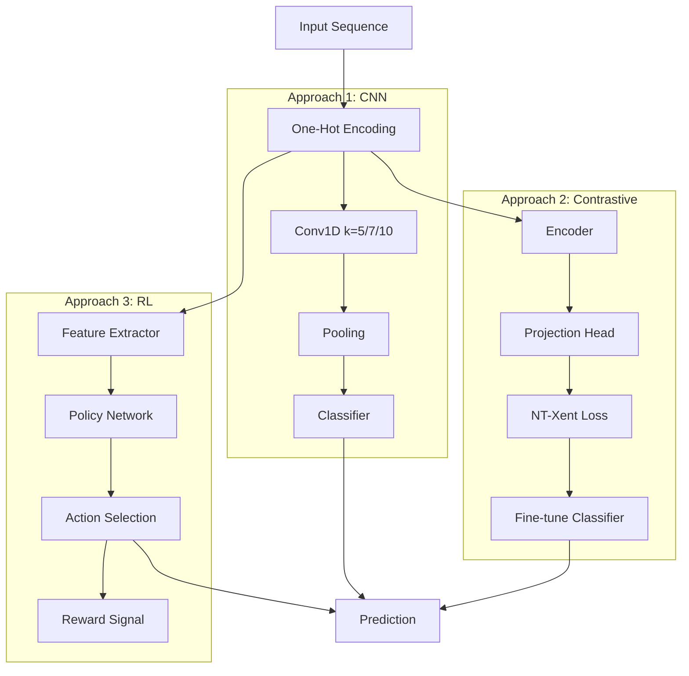

# Training Approaches Overview

MetaPathPredict offers three distinct training approaches, each suited for different scenarios.

## Comparison

| Approach | Best For | Labeled Data | Training Time | Complexity |
|----------|----------|--------------|---------------|------------|
| **Configurable CNN** | Standard classification | Required | Fast | Low |
| **Contrastive Learning** | Limited labels | Optional | Medium | Medium |
| **Reinforcement Learning** | Custom rewards | Required | Slow | High |

## 1. Configurable CNN

Traditional supervised learning with adjustable kernel sizes.

```python
from metapathpredict.models import ConfigurableCNN

model = ConfigurableCNN(
    kernel_preset="medium",  # 5, 7, or 10
    num_classes=3,
)
```

**Key Features:**

- 🎯 Kernel size presets (5, 7, 10) for different pattern scales
- ⚡ Fast training with standard cross-entropy loss
- 📊 Easy to interpret and debug

**When to Use:**

- You have sufficient labeled data
- You need fast iteration and experimentation
- You want interpretable models

[Learn more →](cnn.md)

## 2. Contrastive Learning

Self-supervised pretraining followed by fine-tuning.

```python
from metapathpredict.models import ContrastiveModel

model = ContrastiveModel(
    encoder=base_encoder,
    projection_dim=128,
    temperature=0.5,
)
```

**Key Features:**

- 🔄 SimCLR and SupCon implementations
- 🎨 Data augmentation (crop, mask, noise)
- 📈 Transfer learning friendly

**When to Use:**

- Limited labeled data but lots of unlabeled sequences
- You want to learn general sequence representations
- Transfer learning scenarios

[Learn more →](contrastive.md)

## 3. Deep Reinforcement Learning

Treat classification as a sequential decision problem.

```python
from metapathpredict.models import DQNAgent, PolicyGradientAgent

agent = PolicyGradientAgent(
    state_dim=128,
    action_dim=3,
)
```

**Key Features:**

- 🎮 DQN, Policy Gradient, Actor-Critic
- 🎯 Custom reward functions
- 🔍 Exploration-exploitation balance

**When to Use:**

- Custom reward functions needed
- Sequential decision-making scenarios
- Research and experimentation

[Learn more →](reinforcement.md)

## Architecture Diagram



## Choosing an Approach

### Decision Tree

```
Do you have labeled data?
├── Yes
│   └── Is it abundant (>10k samples)?
│       ├── Yes → Configurable CNN
│       └── No → Contrastive Learning (pretrain + fine-tune)
└── No
    └── Do you have unlabeled data?
        ├── Yes → Contrastive Learning (self-supervised)
        └── No → Collect more data
        
Do you need custom reward functions?
└── Yes → Reinforcement Learning
```

### Performance Comparison

On our benchmark dataset (60k sequences, 3 classes):

| Approach | Accuracy | F1-Score | Training Time |
|----------|----------|----------|---------------|
| CNN (k=5) | 94.2% | 0.941 | 15 min |
| CNN (k=7) | 95.1% | 0.950 | 18 min |
| CNN (k=10) | 94.8% | 0.946 | 22 min |
| Contrastive | 95.8% | 0.957 | 45 min |
| RL (REINFORCE) | 93.5% | 0.932 | 120 min |

## Next Steps

- [Configurable CNN](cnn.md) - Deep dive into CNN architecture
- [Contrastive Learning](contrastive.md) - Self-supervised pretraining
- [Reinforcement Learning](reinforcement.md) - RL-based classification
