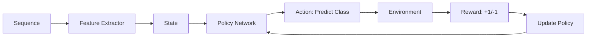

# Reinforcement Learning

Deep Reinforcement Learning approach treats sequence classification as a decision-making problem.

## Overview



## Algorithms

### REINFORCE (Policy Gradient)

Simple policy gradient with likelihood ratio:

```python
from metapathpredict.models import PolicyGradientAgent

agent = PolicyGradientAgent(
    state_dim=256,
    action_dim=3,  # num_classes
    hidden_dim=128,
)
```

### DQN (Deep Q-Network)

Value-based approach with experience replay:

```python
from metapathpredict.models import DQNAgent

agent = DQNAgent(
    state_dim=256,
    action_dim=3,
    hidden_dim=128,
    epsilon=0.1,
    gamma=0.99,
)
```

### A2C (Actor-Critic)

Combines policy and value learning:

```python
from metapathpredict.models import ActorCriticAgent

agent = ActorCriticAgent(
    state_dim=256,
    action_dim=3,
    hidden_dim=128,
)
```

## Environment

### Sequence Classification Environment

```python
from metapathpredict.models import SequenceClassificationEnv

# Create environment
env = SequenceClassificationEnv(
    sequences=X_train,
    labels=y_train,
    encoder=feature_encoder,
)

# Reset to get initial state
state = env.reset()

# Take action
action = agent.select_action(state)
next_state, reward, done, info = env.step(action)
```

### Reward Function

Default rewards:
- **+1.0**: Correct classification
- **-1.0**: Incorrect classification

Custom rewards:

```python
class CustomReward:
    def __init__(self, class_weights):
        self.weights = class_weights
    
    def __call__(self, action, true_label):
        if action == true_label:
            return self.weights[action]  # Class-weighted reward
        return -1.0

env = SequenceClassificationEnv(
    sequences=X_train,
    labels=y_train,
    reward_fn=CustomReward({0: 1.5, 1: 1.0, 2: 1.0}),
)
```

## Training

### Configuration

```yaml
model:
  architecture: reinforcement
  rl_algorithm: reinforce  # "dqn", "reinforce", "a2c"
  hidden_dim: 256

training:
  episodes: 10000
  batch_size: 32
  learning_rate: 0.0007
  gamma: 0.99  # Discount factor

rl:
  epsilon_start: 1.0
  epsilon_end: 0.1
  epsilon_decay: 0.995
  target_update: 100  # DQN only
  replay_buffer_size: 10000
```

### REINFORCE Training

```python
import torch.optim as optim

# Create agent
agent = PolicyGradientAgent(state_dim=256, action_dim=3)
optimizer = optim.Adam(agent.parameters(), lr=7e-4)

for episode in range(10000):
    state = env.reset()
    log_probs = []
    rewards = []
    
    # Collect trajectory
    done = False
    while not done:
        action, log_prob = agent.select_action(state)
        next_state, reward, done, _ = env.step(action)
        
        log_probs.append(log_prob)
        rewards.append(reward)
        state = next_state
    
    # Compute returns
    returns = compute_returns(rewards, gamma=0.99)
    
    # Policy gradient update
    loss = 0
    for log_prob, R in zip(log_probs, returns):
        loss -= log_prob * R
    
    optimizer.zero_grad()
    loss.backward()
    optimizer.step()
```

### DQN Training

```python
from metapathpredict.models import ReplayBuffer

# Create components
agent = DQNAgent(state_dim=256, action_dim=3)
target_agent = DQNAgent(state_dim=256, action_dim=3)
target_agent.load_state_dict(agent.state_dict())
replay_buffer = ReplayBuffer(capacity=10000)

for episode in range(10000):
    state = env.reset()
    total_reward = 0
    
    while True:
        # Epsilon-greedy action
        action = agent.select_action(state, epsilon)
        next_state, reward, done, _ = env.step(action)
        
        # Store transition
        replay_buffer.push(state, action, reward, next_state, done)
        
        # Train if enough samples
        if len(replay_buffer) > batch_size:
            batch = replay_buffer.sample(batch_size)
            loss = agent.update(batch, target_agent)
        
        total_reward += reward
        state = next_state
        
        if done:
            break
    
    # Update target network
    if episode % target_update == 0:
        target_agent.load_state_dict(agent.state_dict())
    
    # Decay epsilon
    epsilon = max(epsilon_end, epsilon * epsilon_decay)
```

## Policy Network Architecture

```
State: (state_dim,)
    │
    ▼
┌─────────────────────────────┐
│   Linear(state_dim, 128)    │
│   ReLU                      │
└─────────────────────────────┘
    │
    ▼
┌─────────────────────────────┐
│   Linear(128, 128)          │
│   ReLU                      │
└─────────────────────────────┘
    │
    ▼
┌─────────────────────────────┐
│   Linear(128, action_dim)   │
│   Softmax                   │
└─────────────────────────────┘
    │
    ▼
Action Probabilities: (action_dim,)
```

## Advanced Features

### Prioritized Experience Replay

```python
from metapathpredict.models import PrioritizedReplayBuffer

buffer = PrioritizedReplayBuffer(
    capacity=10000,
    alpha=0.6,  # Prioritization exponent
    beta=0.4,   # Importance sampling
)
```

### Curriculum Learning

Start with easy examples:

```python
class CurriculumEnv(SequenceClassificationEnv):
    def __init__(self, sequences, labels, encoder, difficulty_fn):
        super().__init__(sequences, labels, encoder)
        self.difficulty = difficulty_fn(sequences)
        self.current_difficulty = 0.0
    
    def reset(self):
        # Sample based on current difficulty
        mask = self.difficulty <= self.current_difficulty
        idx = np.random.choice(np.where(mask)[0])
        return self._get_state(idx)
    
    def increase_difficulty(self, amount=0.1):
        self.current_difficulty = min(1.0, self.current_difficulty + amount)
```

### Multi-Agent Training

Train multiple agents with different strategies:

```python
agents = [
    PolicyGradientAgent(state_dim, action_dim),
    DQNAgent(state_dim, action_dim),
    ActorCriticAgent(state_dim, action_dim),
]

# Ensemble voting
def ensemble_predict(state):
    votes = [agent.select_action(state) for agent in agents]
    return max(set(votes), key=votes.count)
```

## Reward Shaping

### Confidence-Based Reward

```python
def confidence_reward(action, true_label, probs):
    if action == true_label:
        return probs[action]  # Higher reward for confident correct
    return -probs[action]  # Higher penalty for confident wrong
```

### Progressive Reward

```python
def progressive_reward(action, true_label, episode):
    base_reward = 1.0 if action == true_label else -1.0
    # Increase reward over time
    return base_reward * (1 + episode / 10000)
```

## Hyperparameters

| Parameter | REINFORCE | DQN | A2C |
|-----------|-----------|-----|-----|
| Learning Rate | 7e-4 | 1e-3 | 7e-4 |
| Gamma | 0.99 | 0.99 | 0.99 |
| Hidden Dim | 128 | 256 | 128 |
| Epsilon Start | - | 1.0 | - |
| Epsilon End | - | 0.1 | - |
| Target Update | - | 100 | - |
| Entropy Coef | - | - | 0.01 |

## Performance

### Benchmark Results

| Algorithm | Accuracy | Episodes | Time |
|-----------|----------|----------|------|
| REINFORCE | 93.5% | 10000 | 60m |
| DQN | 94.1% | 10000 | 90m |
| A2C | 94.8% | 10000 | 75m |

### When to Use RL

✅ **Good for:**
- Custom reward functions
- Sequential processing
- Research/experimentation

❌ **Not ideal for:**
- Simple classification (use CNN)
- Limited compute (sample inefficient)
- Production (harder to debug)

## Next Steps

- [Training Overview](overview.md) - Compare all approaches
- [User Guide](../user-guide/training.md) - Detailed training instructions
- [API Reference](../api/models.md) - Full API documentation
