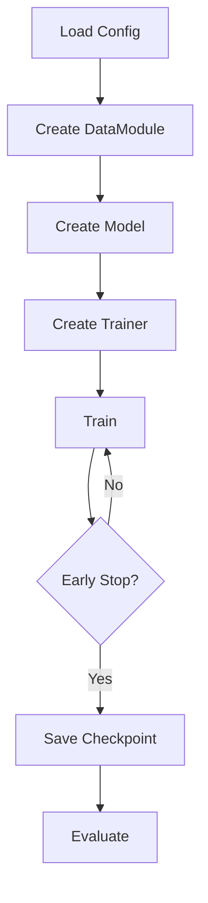

# Training Guide

Comprehensive guide to training models with MetaPathPredict.

## Quick Start

```bash
metapathpredict train --config config.yaml
```

## Training Workflow



## Configuration

### Minimal Config

```yaml
model:
  kernel_preset: medium

training:
  epochs: 100
  batch_size: 32
  learning_rate: 0.001
```

### Full Config

```yaml
model:
  architecture: cnn
  kernel_preset: medium
  hidden_channels: [32, 64, 128]
  dropout: 0.3

training:
  epochs: 100
  batch_size: 32
  learning_rate: 0.001
  weight_decay: 0.0001
  scheduler: cosine
  warmup_epochs: 5
  min_lr: 0.000001
  use_amp: true
  early_stopping: true
  patience: 10
  gradient_clip: 1.0

data:
  max_length: 500
  num_workers: 4
  pin_memory: true
```

## Training Script

### Basic Training

```python
from metapathpredict.config import Config
from metapathpredict.models import ConfigurableCNN
from metapathpredict.training import Trainer
from metapathpredict.data import SequenceDataModule

# Load config
config = Config.from_yaml("config.yaml")

# Create data module
datamodule = SequenceDataModule(
    data_dir="data/datasets/unified",
    batch_size=config.training.batch_size,
    num_workers=config.data.num_workers,
)
datamodule.setup()

# Create model
model = ConfigurableCNN(
    input_channels=4,
    num_classes=3,
    kernel_preset=config.model.kernel_preset,
)

# Create trainer
trainer = Trainer(
    model=model,
    config=config,
    device="cuda" if torch.cuda.is_available() else "cpu",
)

# Train
history = trainer.fit(
    train_loader=datamodule.train_dataloader(),
    val_loader=datamodule.val_dataloader(),
)
```

### With Callbacks

```python
from metapathpredict.training.callbacks import (
    EarlyStopping,
    ModelCheckpoint,
    LearningRateMonitor,
    MetricsLogger,
)

callbacks = [
    EarlyStopping(patience=10, monitor="val_loss"),
    ModelCheckpoint(
        dirpath="checkpoints",
        filename="best_model",
        monitor="val_accuracy",
        mode="max",
    ),
    LearningRateMonitor(),
    MetricsLogger(log_dir="logs"),
]

trainer = Trainer(
    model=model,
    config=config,
    callbacks=callbacks,
)
```

## Learning Rate Scheduling

### Cosine Annealing

```yaml
training:
  scheduler: cosine
  warmup_epochs: 5
  min_lr: 0.000001
```

### One Cycle

```yaml
training:
  scheduler: onecycle
  max_lr: 0.01
```

### Step Decay

```yaml
training:
  scheduler: step
  step_size: 30
  gamma: 0.1
```

### Manual Schedule

```python
from torch.optim.lr_scheduler import LambdaLR

def lr_lambda(epoch):
    if epoch < 10:
        return epoch / 10  # Warmup
    return 0.95 ** (epoch - 10)  # Exponential decay

scheduler = LambdaLR(optimizer, lr_lambda)
```

## Mixed Precision Training

### Automatic Mixed Precision (AMP)

```yaml
training:
  use_amp: true
```

### Manual AMP

```python
from torch.cuda.amp import autocast, GradScaler

scaler = GradScaler()

for batch in train_loader:
    optimizer.zero_grad()
    
    with autocast():
        output = model(batch)
        loss = criterion(output, targets)
    
    scaler.scale(loss).backward()
    scaler.step(optimizer)
    scaler.update()
```

## Gradient Management

### Gradient Clipping

```yaml
training:
  gradient_clip: 1.0  # Max gradient norm
```

### Gradient Accumulation

For larger effective batch sizes:

```yaml
training:
  batch_size: 8
  accumulation_steps: 4  # Effective batch = 32
```

```python
accumulation_steps = 4

for i, batch in enumerate(train_loader):
    loss = model(batch) / accumulation_steps
    loss.backward()
    
    if (i + 1) % accumulation_steps == 0:
        optimizer.step()
        optimizer.zero_grad()
```

## Distributed Training

### DataParallel (Single Node)

```python
model = nn.DataParallel(model)
```

### DistributedDataParallel

```python
import torch.distributed as dist

dist.init_process_group("nccl")
model = nn.parallel.DistributedDataParallel(model)
```

### Using Ray

```python
from metapathpredict.pipeline import RayTrainer

ray_trainer = RayTrainer(
    model_class=ConfigurableCNN,
    model_config=config.model,
    num_workers=4,
    use_gpu=True,
)

ray_trainer.fit(train_dataset, val_dataset, epochs=100)
```

## Checkpointing

### Save Checkpoint

```python
torch.save({
    'epoch': epoch,
    'model_state_dict': model.state_dict(),
    'optimizer_state_dict': optimizer.state_dict(),
    'scheduler_state_dict': scheduler.state_dict(),
    'loss': loss,
    'config': config.model_dump(),
}, 'checkpoint.pt')
```

### Resume Training

```python
checkpoint = torch.load('checkpoint.pt')

model.load_state_dict(checkpoint['model_state_dict'])
optimizer.load_state_dict(checkpoint['optimizer_state_dict'])
scheduler.load_state_dict(checkpoint['scheduler_state_dict'])
start_epoch = checkpoint['epoch'] + 1
```

## Monitoring

### TensorBoard

```python
from torch.utils.tensorboard import SummaryWriter

writer = SummaryWriter("runs/experiment_1")

for epoch in range(epochs):
    writer.add_scalar("Loss/train", train_loss, epoch)
    writer.add_scalar("Loss/val", val_loss, epoch)
    writer.add_scalar("Accuracy/val", val_acc, epoch)

writer.close()
```

```bash
tensorboard --logdir runs
```

### Experiment Tracking

See [Experiment Tracking Guide](tracking.md) for MLflow/W&B integration.

## Training Tips

### Debugging

```python
# Enable anomaly detection
torch.autograd.set_detect_anomaly(True)

# Check for NaN
if torch.isnan(loss):
    print("NaN detected!")
    breakpoint()
```

### Reproducibility

```python
import torch
import numpy as np
import random

def set_seed(seed):
    torch.manual_seed(seed)
    torch.cuda.manual_seed_all(seed)
    np.random.seed(seed)
    random.seed(seed)
    torch.backends.cudnn.deterministic = True
    torch.backends.cudnn.benchmark = False

set_seed(42)
```

### Memory Management

```python
# Clear cache periodically
torch.cuda.empty_cache()

# Use gradient checkpointing
from torch.utils.checkpoint import checkpoint

def forward(self, x):
    x = checkpoint(self.layer1, x)
    x = checkpoint(self.layer2, x)
    return x
```

## Common Issues

### CUDA Out of Memory

1. Reduce batch size
2. Use gradient accumulation
3. Enable gradient checkpointing
4. Use mixed precision

### Slow Training

1. Increase `num_workers`
2. Enable `pin_memory`
3. Use SSD for data
4. Profile with `torch.profiler`

### Overfitting

1. Increase dropout
2. Add data augmentation
3. Use early stopping
4. Reduce model size

### Underfitting

1. Increase model capacity
2. Train longer
3. Reduce regularization
4. Check data quality

## Next Steps

- [Inference Guide](inference.md) - Make predictions
- [Experiment Tracking](tracking.md) - Track experiments
- [API Reference](../api/training.md) - Training API docs
